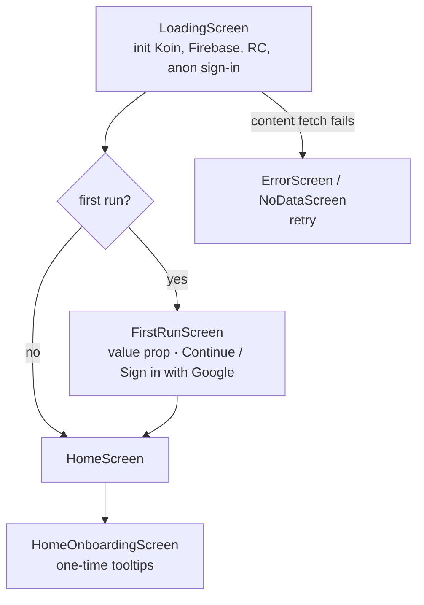
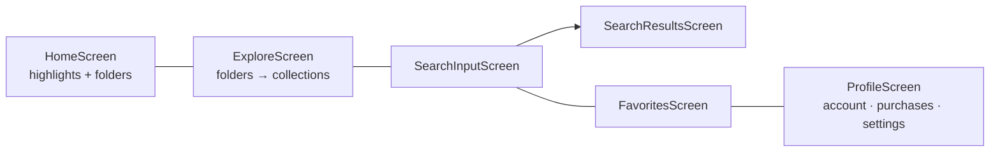
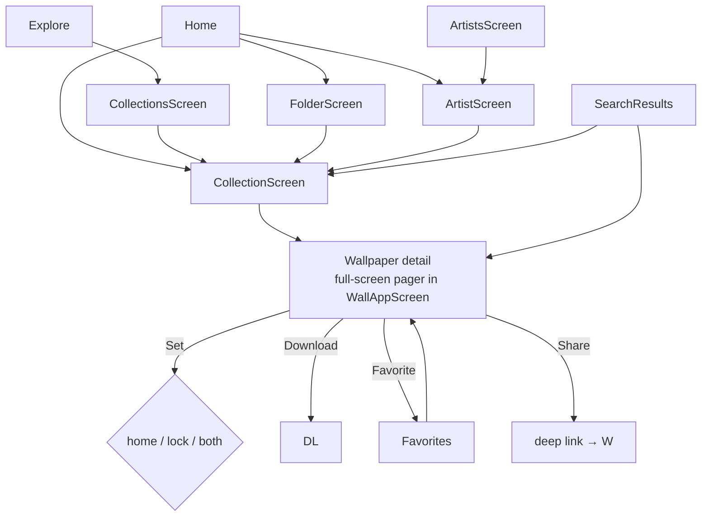
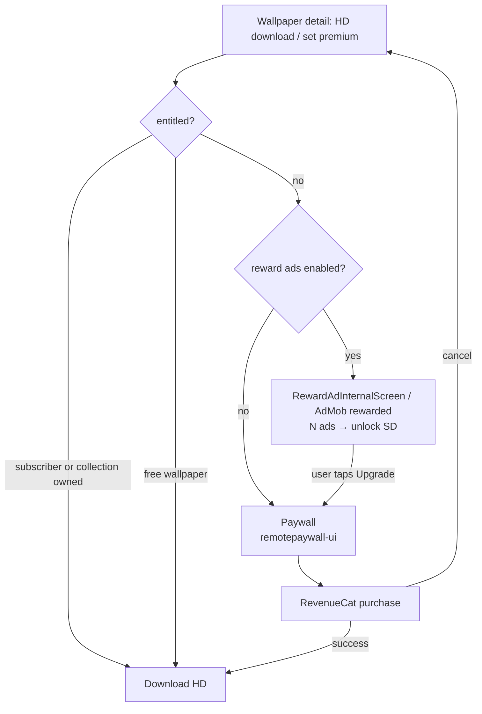
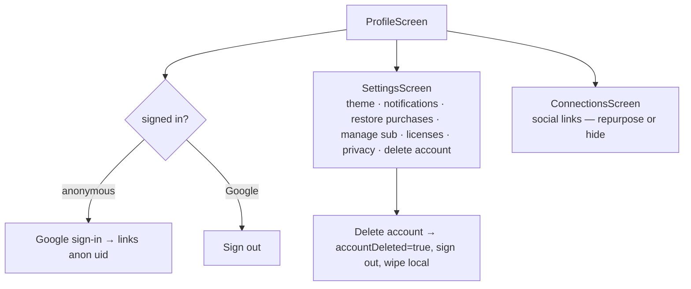

# 03 — App flow

Screen names below map 1:1 to `shared/presentation/wallapp-ui/.../*Screen.kt` so Claude Code can find them.

## Launch

## Main navigation (bottom bar)

## Content drill-down

## Premium gate

## Account

## Debug-only
`ShowcaseAdsScreen`, `ShowcaseTypefaceScreen`, `ShowcaseIosNativeFeedScreen`, `IndexScreen` — keep behind debug build config.
